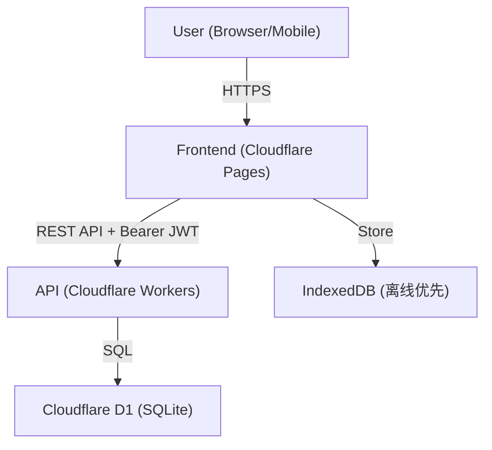

# Question Site - Flexible Edition (LMS Genesis)

## 📖 项目概述 (Project Overview)

这是一个**纯 Cloudflare 免费方案**的在线题库与刷题平台：前端托管在 **Cloudflare Pages**，后端 API 是 **Cloudflare Workers**，数据库为 **Cloudflare D1 (SQLite)**，全程不依赖 GitHub Pages、Vercel、Supabase 或任何第三方服务。

**在线地址**：<https://question-site-front.pages.dev>（管理后台：<https://question-site-front.pages.dev/admin.html>）

项目采用前后端分离架构，前端为纯静态单页应用 (SPA，无构建工具)，多设备数据通过后端乐观锁 + 增量同步保持一致。

---

## 🏗️ 系统架构 (Architecture)



### 核心技术栈 (Tech Stack)

*   **前端**: HTML5 / Vanilla JS (ES Modules，无构建工具)、Tailwind CSS (CDN)、IndexedDB 本地存储
*   **后端**: Cloudflare Workers（单文件 `worker/index.js`，原生 Web Crypto 实现 JWT 签发/校验与 PBKDF2 密码哈希）
*   **数据库**: Cloudflare D1，四张表 `users` / `question_sets` / `questions` / `sync_logs`（迁移见 `worker/migrations/`）

---

## ✨ 核心功能 (Key Features)

1.  **题库管理**：无限层级「科目 → 章节」；单选 / 多选 / 判断三种题型；JSON 导入导出（导入前预览、可改归属、重复与相似题检测）；导入时自动改写重复/缺失的题目 ID，保证预览数量与实际导入数量一致；科目/章节重命名与软删除回收站。
2.  **多模式刷题**：顺序 / 随机 / 错题突击 / 智能推荐；作答时长统计。
3.  **云端同步**：IndexedDB 离线优先 + 400ms 防抖上传；基于版本号的乐观锁（冲突返回 409 并自动恢复）；作答记录增量上传（`historyAppend`）；ETag 条件加载（304 省流量）；60 秒轮询兜底，可选 WebSocket 实时推送（`REALTIME_WS_URL`）；本地存在未上传修改时加载不覆盖本地，同设备换账号自动隔离数据。
4.  **管理后台** (`admin.html`)：用户列表（最近活跃 / IP / 设备）、建用户、批量删除、题库透视与可视化编辑（`set-details` / `users-update-bank`）、全局广播（单人 / 多选 / 全员）、系统日志。

### 👤 注册与登录 (Auth Behavior)

*   只需「用户名 + 密码」，不发送邮件；同一用户名（不区分大小写）只能注册一次，密码至少 6 位。
*   登录后签发 HS256 JWT（7 天有效），前端存于 localStorage。
*   管理员由 `ADMIN_USERNAMES`（默认 `admin`）判定：**部署后请第一时间注册该用户名**，否则会被他人抢注。

---

## 📂 项目结构 (Project Structure)

| 路径 | 说明 |
| :--- | :--- |
| `index.html` | 用户主应用（刷题 / 题库 / 分析） |
| `admin.html` | 管理后台（单文件，含全部管理逻辑） |
| `config.js` | 前端唯一配置：`window.API_BASE` 指向 Worker 域名 |
| `js/` | ES 模块：`app` 入口、`auth` 登录、`data/sync/realtime` 数据与同步、`quiz` 刷题、`ui` 弹窗与编辑器、`router` 路由、`db` IndexedDB、`utils` 工具、`chart` 原生 Canvas 图表、`views/*` 视图 |
| `worker/index.js` | 后端 API（Auth + 题库 CRUD + Admin 全部接口） |
| `worker/migrations/` | D1 建表迁移 |
| `worker/wrangler.json` | Worker 配置（D1 绑定、`ADMIN_USERNAMES`） |
| `scripts/stage-pages.mjs` | Pages 部署前的文件整理脚本 |

### 后端 API 一览 (`worker/index.js`)

| 端点 | 说明 |
| :--- | :--- |
| `POST /api/auth/signup` `/api/auth/login` | 注册 / 登录，返回 JWT |
| `GET /api/load-question-set` | 加载题库（支持 `historyAfter` 增量、ETag/304） |
| `POST /api/save-question-set` | 保存题库（乐观锁、全量/增量、题目指纹去重） |
| `GET /api/sync-logs` | 当前用户同步日志（50 条） |
| `GET /api/admin/users-list` | 用户列表（含最近活跃 / IP / 设备，50 条） |
| `POST /api/admin/create-user` `/api/admin/delete-users` | 建用户 / 批量删除（级联清理题库与日志） |
| `GET /api/admin/users-sets` `set-details` `users-get-bank` | 查看用户题集 / 单个题集详情 / 题库 |
| `POST /api/admin/users-update-bank` | 管理员整库替换（setId + name + questions） |
| `POST /api/admin/push-broadcast` | 全局广播（追加式，`target: user/multi/all`） |
| `GET /api/admin/system-logs` | 全站同步日志（100 条） |

---

## 🚀 部署指南 (Deployment · 全程 Cloudflare 免费版)

> 前置要求：Node.js 18+，一个 Cloudflare 账号；先运行 `npx wrangler login` 完成授权。**不需要 GitHub**——以下全部通过 Wrangler 直传。

### 1. 创建 D1 数据库并建表

```bash
cd worker
npx wrangler d1 create question-site-db
# 把输出的 database_id 填入 worker/wrangler.json 的 d1_databases[0].database_id
npx wrangler d1 migrations apply question-site-db --remote
```

### 2. 配置并部署后端 Worker

```bash
# 设置 JWT 签名密钥（至少 8 位，建议 32 位以上随机字符串；不要提交进 git）
npx wrangler secret put JWT_SECRET
# 部署
npm run deploy:worker
```

部署完成后记下 Worker 域名（形如 `https://question-site-api.<你的子域>.workers.dev`）。

### 3. 配置前端并部署 Pages

1.  修改根目录 `config.js`：

```js
window.API_BASE = "https://question-site-api.<你的子域>.workers.dev";
```

2.  部署（脚本会先整理 `.pages-dist/` 再上传，避免把 worker 源码传成静态资源）：

```bash
npm run deploy:pages
```

得到前端地址（形如 `https://question-site-front.pages.dev`）。

### 4. 打通 CORS（重要）

在 Cloudflare 控制台 → Workers → `question-site-api` → Settings → Variables，添加环境变量：

| 变量 | 值 |
| :--- | :--- |
| `CORS_ORIGIN` | `https://question-site-front.pages.dev`（你的 Pages 域名） |
| `ADMIN_USERNAMES` | `admin`（管理员用户名，多个用逗号分隔；也可直接写在 `worker/wrangler.json` 的 vars 里） |

不配置时 Worker 仅放行 `*.question-site-front.pages.dev` 和 `localhost:8788`。

### 5. 初始化管理员

打开 `https://<你的pages域名>/admin.html`，用 `ADMIN_USERNAMES` 中的用户名（默认 `admin`）注册并登录。**请尽快完成，防止被抢注。**

### 可选：WebSocket 实时推送

自建网关不在本仓库内；如部署了网关，在前端 `index.html` 之前设置 `window.REALTIME_WS_URL = "wss://…/realtime"` 即可启用，未配置时自动退化为 60 秒轮询。

---

## 💻 本地开发 (Local Development)

```bash
# 终端 1：本地 Worker + 本地 D1（自动使用 .wrangler/state 下的 SQLite）
cd worker
npx wrangler d1 migrations apply question-site-db --local
npx wrangler dev --port 8787

# 终端 2：本地静态站（8788 在 Worker 的 CORS 白名单内）
node scripts/stage-pages.mjs
npx wrangler pages dev .pages-dist --port 8788
# 然后临时把 config.js 的 API_BASE 改为 http://localhost:8787（勿提交）
```

---

## ⚠️ 开发者注意事项 (Developer Notes)

*   **版本控制**：前端与后端的 `version` 必须严格匹配，否则返回 `409 Conflict`；前端收到 409 会自动拉取最新数据并重试一次。
*   **保存原子性**：后端使用 `env.DB.batch()` 一次原子写入（含版本号自增、题目重写、同步日志），不要改成逐条执行。
*   **本地脏数据保护**：本地存在未上传修改（保存在途 / 保存被挂起 / 脏标记）时，轮询或推送触发的加载不会应用云数据，只增量并入服务端新增的作答记录；保存成功仅在期间无新编辑时清除脏标记。这条防线防止轮询用旧云数据覆盖更新的本地编辑。
*   **多账号数据隔离**：IndexedDB 记录本地数据归属账号（`lms_v26_last_user`）；同设备换账号且云端为空时，自动清空上一账号残留的本地数据。
*   **D1 限额**：单条 SQL 100KB、单查询绑定参数 100 个（见 [Cloudflare D1 Limits](https://developers.cloudflare.com/d1/platform/limits/)）；超大题库保存时注意载荷体积。
*   **安全基线**：JWT_SECRET 走 `wrangler secret`（勿写进 wrangler.json）；JWT 存于浏览器 localStorage，属个人/小团队工具的取舍；登录接口无内置限速，如公开部署建议在 Worker 前加 Cloudflare WAF 规则。

---

## 📝 更新记录 (Changelog)

*   **2026-09**：修复模块化拆分引入的致命语法错误（应用此前完全无法启动）与丢失的刷题模块；管理后台接口与后端对齐（`set-details`、`users-update-bank` 等）；移除 AI 功能（模型配置、AI 问答、AI 导入、AI 错题分析）；修复 5 处 XSS 注入点；修复同步竞态（并发加载覆盖未上传的本地修改、被吞掉的挂起保存）；增加多账号本地数据隔离；修复导入丢题（章节内重复 ID 自动改写，预览数量与实际导入数量一致）；新增 Cloudflare Pages 部署脚本，文档全面迁移到 Cloudflare 方案；图表优化（无练习日断线而非误画 0%、密集标签稀疏化、暗色模式适配）、连续学习天数改为从昨天起算、修复导入预览「应用」按钮首次使用必报错、抽离预览渲染公共函数、修复相似题图标与视口缩放限制。
*   **2026-07**：从 Supabase + Vercel 迁移到 Cloudflare Workers + D1。

