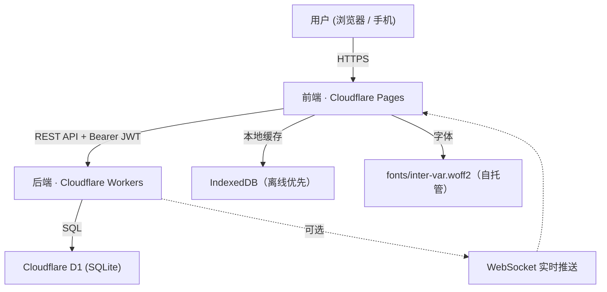

# Question Site (LMS Genesis)

[](https://workers.cloudflare.com/)

一个**纯 Cloudflare 免费方案**的在线题库与刷题平台：前端 **Cloudflare Pages**、后端 **Cloudflare Workers**、数据库 **Cloudflare D1 (SQLite)**，全程不依赖 GitHub Pages、Vercel、Supabase 或任何第三方服务。

| | 地址 |
| :--- | :--- |
| **用户端** | <https://question-site-front.pages.dev> |
| **管理后台** | <https://question-site-front.pages.dev/admin.html> |
| **后端 API** | `https://question-site-api.combodevy-9b0.workers.dev` |

> 本仓库即主项目：前端 Cloudflare Pages（`question-site-front`）、后端 Worker（`question-site-api`）、数据库 D1（`question-site-db`）三者通过 `scripts/check-deploy-target.mjs` 绑定为同一环境，防止配置交叉污染。`deploy-mirror.sh` 是给测试环境（mirror）用的副本脚本，不属于主部署流程。

---

## 📖 项目概述

前后端分离：前端为纯静态单页应用（**无构建工具**，直接 ES Modules + Tailwind CDN），多设备数据通过**乐观锁 + 增量同步**保持一致，本地以 IndexedDB 做离线优先缓存。内置 **SM-2 间隔复习**（Anki 同款遗忘曲线）、**四种题型**（单选 / 多选 / 判断 / 填空）、**键盘刷题**与完整的错题回收体系。

---

## 🏗️ 系统架构


```mermaid
graph TD
    User["用户 (浏览器 / 手机)"] -->|HTTPS| Frontend["前端 · Cloudflare Pages"]
    Frontend -->|"REST API + Bearer JWT"| Backend["后端 · Cloudflare Workers"]
    Backend -->|SQL| DB["Cloudflare D1 (SQLite)"]
    Frontend -->|本地缓存| Local["IndexedDB（离线优先）"]
    Frontend -->|字体| Font["fonts/inter-var.woff2（自托管）"]
    Backend -.->|可选| WS["WebSocket 实时推送"]
    WS -.-> Frontend
```

### 技术栈

| 层 | 技术 |
| :--- | :--- |
| 前端 | HTML5 / Vanilla JS (ES Modules，无构建工具)、Tailwind CSS (CDN)、原生 Canvas 图表、IndexedDB、自托管 Inter 可变字体 |
| 后端 | Cloudflare Workers（单文件 `worker/index.js`，原生 Web Crypto 实现 JWT 签发/校验与 PBKDF2 密码哈希） |
| 数据库 | Cloudflare D1，四张表 `users` / `question_sets` / `questions` / `sync_logs` |

---

## ✨ 核心功能

1. **题库管理** —— 无限层级「科目 → 章节」；单选 / 多选 / 判断 / **填空**四种题型（填空支持多个可接受答案，`|` 分隔）；JSON 导入导出（导入前预览、可改归属、重复与相似题检测、**拖拽 .json 直接解析**）；导入时自动改写重复/缺失的题目 ID，保证预览数量与实际导入数量一致；科目/章节重命名与**软删除回收站**（可恢复 / 彻底删除 / 清空）。
2. **多模式刷题** —— 顺序 / 随机 / 错题突击 / **间隔复习**；作答时长统计；**键盘作答**（A–D 或 1–4 直选，Enter 提交 / 下一题）。
3. **SM-2 间隔复习** —— Anki 同款遗忘曲线算法：答错当天重学，连对按间隔 ×1 → ×6 → 间隔×难度系数递增（答错降难度、答对升难度）；首页显示「今日待复习 N 题」横幅，一键开始；复习计划由作答记录推导，随云端同步多设备一致。
4. **学习分析** —— 总览与单科两种视图；30 天热力图、各科目与题型正确率、作答时长分布、遗忘曲线、耗时题目排行。
5. **账号安全** —— 用户自助**修改密码**（验证原密码）；管理员可**重置任意用户密码**（忘记密码的运营兜底）；改密码走 PBKDF2 重新加盐。
6. **云端同步** —— IndexedDB 离线优先 + 400ms 防抖上传；基于版本号的乐观锁（冲突返回 409 并自动恢复）；作答记录增量上传（`historyAppend`）；ETag 条件加载（304 省流量）；60 秒轮询兜底 + **切回标签页自动拉取** + **网络恢复自动补传**；可选 WebSocket 实时推送；**本地存在未上传修改时加载不覆盖本地**；同设备换账号自动隔离数据。
7. **管理后台**（`admin.html`，单文件）—— 用户列表（最近活跃 / IP / 设备）、建用户、批量删除、**重置用户密码**、题库透视与可视化编辑（支持填空题）、全局广播（单人 / 多选 / 全员，含指纹去重）、系统日志（含**前端错误上报**）、JSON 导出。

### 交互与体验

- 弹窗支持**点空白处关闭**与 **Esc 关闭**（多层弹窗按 DOM 顺序关最上层）；会丢未保存内容的两个弹窗（题目编辑器、导入预览）不参与，只能明确关闭；Esc 在没有弹窗时会关掉抽屉 / 账户菜单。
- 题库页**增量渲染**：首批 100 条，滚动到底自动追加，几万题也不会卡（实测 6000 题初始渲染 119ms / 101 个节点）。
- 切换视图时滚动位置自动归零；「回到顶部」按钮滚的是真正的滚动容器。
- **自动刷新体系**：登录 / 云同步完成 / 导入成功 / 回收站恢复 / 科目重命名 / 切回标签页 / 网络恢复——所有数据变化时刻都会自动刷新界面，无需手动刷新页面。
- **版本检测**：部署新版本后，已打开的页面会弹出「应用已更新 · 立即刷新」提示条（避免一直跑旧代码）。
- **全局错误提示与上报**：未捕获异常会以红色提示条显示，并上报到后端日志（管理后台可见），不存在「点了没反应却查不到原因」的情况。
- 账户菜单（右上角头像）：个人信息、题库 / 正确率 / 连续天数速览、导入题库、导出全部题库（JSON 备份）、同步记录、回收站（含数量徽标）、修改密码、退出登录。

### ♿ 无障碍

- 所有图标按钮都有 `aria-label`（读屏可识别）。
- 全局 `:focus-visible` 焦点环 —— 页面里不少输入框/下拉用了 `outline-none`，会移除浏览器默认焦点环；现在键盘 Tab 时统一有清晰焦点指示，鼠标点击不受影响。
- `<html lang="zh-CN">`、密码框 `<label for>` 关联、弹窗内可 Tab 遍历。

> **已知待改进**：部分正文颜色对比度未达 WCAG AA（例如主色 `text-primary-600` 白底 3.74:1，需 ≥4.5:1）。修复需要**按明暗模式分别配色**（浅色加深、深色提亮），属设计层改动，尚未实施。

---

## 👤 注册与登录

- 只需「用户名 + 密码」，不发送邮件；同一用户名（不区分大小写）只能注册一次，密码至少 6 位。
- 登录后签发 **HS256 JWT（7 天有效）**，前端存于 localStorage；过期后自动登出并提示。
- **忘记密码**：联系管理员重置（admin 后台 → 用户行「Reset PW」），或自建环境直接改库。
- 管理员由 `ADMIN_USERNAMES`（默认 `admin`）判定（不信任 JWT 中的 role 字段）：**部署后请第一时间注册该用户名**，否则会被他人抢注。

---

## 📂 项目结构

| 路径 | 说明 |
| :--- | :--- |
| `index.html` | 用户主应用（刷题 / 题库 / 分析） |
| `admin.html` | 管理后台（单文件，含全部管理逻辑） |
| `config.js` | 前端唯一配置：`window.API_BASE` 指向 Worker 域名 |
| `fonts/inter-var.woff2` | 自托管 Inter 可变字体（latin 子集） |
| `js/app.js` | 应用入口：装配 `App`、逐步容错初始化、全局事件绑定、版本检测、错误上报 |
| `js/auth.js` | 登录 / 注册 / 登出、JWT 解析（含过期检测）、登录态应用 |
| `js/data.js` | 数据层：题库 / 记录 / 回收站、乐观锁与增量同步、SM-2 复习引擎、统计 |
| `js/quiz.js` | 刷题流程：出题、判分、多选交互、填空题、**键盘作答**、复习模式 |
| `js/ui.js` | 弹窗与抽屉、题目编辑器、账户菜单、主题、导入拖拽 |
| `js/chart.js` | 原生 Canvas 图表：折线（含断线与圆点标记）/ 条形 / 环形 / 热力图 |
| `js/router.js` | 视图路由 |
| `js/db.js` | IndexedDB 封装 |
| `js/dom.js` | DOM 读写小工具 |
| `js/utils.js` | 工具：转义、拼音、模糊匹配、滚动容器查找、UTC 时间解析、导入清洗与 ID 规范化 |
| `js/views/*.js` | 四个视图：`dashboard` / `library` / `analytics` / `setup` |
| `worker/index.js` | 后端 API（Auth + 改密 + 题库 CRUD + 错误上报 + Admin 全部接口） |
| `worker/migrations/` | D1 建表迁移 |
| `worker/wrangler.json` | Worker 配置（D1 绑定、`ADMIN_USERNAMES`） |
| `scripts/stage-pages.mjs` | Pages 部署前的文件整理脚本（内含部署目标防呆校验） |
| `scripts/check-deploy-target.mjs` | 校验 config.js / Worker 名 / D1 绑定指向同一环境，防交叉污染 |

---

## 🔌 后端 API

### 认证

| 端点 | 说明 |
| :--- | :--- |
| `POST /api/auth/signup` | 注册（密码 ≥6 位，UNIQUE 冲突兜底），返回 JWT |
| `POST /api/auth/login` | 登录，返回 JWT |
| `POST /api/auth/change-password` | 修改密码（需登录 + 验证原密码） |

### 数据

| 端点 | 说明 |
| :--- | :--- |
| `GET /api/load-question-set` | 加载题库（支持 `historyAfter` 增量、ETag / 304；增量游标出现即标记 `historyPartial`，防客户端误整体替换） |
| `POST /api/save-question-set` | 保存题库（乐观锁、全量/增量、题目指纹去重；先校验账户未被删除） |
| `GET /api/sync-logs` | 当前用户同步日志（50 条） |
| `POST /api/client-errors` | 前端错误上报（需登录；管理后台系统日志可见） |

### 管理（`/api/admin/[action]`）

| 端点 | 说明 |
| :--- | :--- |
| `GET users-list` | 用户列表（含最近活跃 / IP / 设备） |
| `POST create-user` | 建用户 |
| `POST delete-users` | 批量删除（级联清理题库与日志；禁止删除自己） |
| `POST reset-user-password` | 重置任意用户密码（仅管理员；不能重置自己） |
| `GET users-sets` | 查看某用户的题集（含题目计数） |
| `GET set-details` | 单个题集详情（含题目） |
| `POST users-update-bank` | 管理员整库替换（校验 setId 归属） |
| `POST push-broadcast` | 全局广播（追加式 + 指纹去重；校验目标用户存在；`target: user / multi / all`） |
| `GET system-logs` | 全站同步日志（100 条，含 client-error） |

---

## 🚀 部署指南（全程 Cloudflare 免费版）

> 前置要求：Node.js 18+，一个 Cloudflare 账号；先运行 `npx wrangler login` 完成授权。**不需要 GitHub** —— 以下全部通过 Wrangler 直传。

### 一键独立部署（推荐）

```bash
npx wrangler d1 migrations apply question-site-db --remote && npx wrangler deploy && npm run deploy:pages
```

脚本会创建独立的 Worker + D1 + Pages，并自动改好 `worker/wrangler.json`、`config.js`、`package.json` 三处名字/绑定。

### 手动部署

```bash
# 1. 创建 D1 并建表
cd worker
npx wrangler d1 create question-site-db
#   把输出的 database_id 填入 worker/wrangler.json 的 d1_databases[0].database_id
npx wrangler d1 migrations apply question-site-db --remote

# 2. 配置密钥并部署后端
npx wrangler secret put JWT_SECRET     # 至少 8 位，建议 32 位以上随机串；不要提交进 git
npm run deploy:worker

# 3. 配置前端并部署
#   修改根目录 config.js 的 window.API_BASE 为你的 Worker 域名
npm run deploy:pages
```

> `deploy:pages` 与 `deploy:worker` 都会先运行 `scripts/check-deploy-target.mjs`，校验 config.js、Worker 名、D1 绑定指向同一环境，防止 mirror / 生产两套环境交叉污染。

### 打通 CORS（重要）

Cloudflare 控制台 → Workers → `question-site-api` → Settings → Variables：

| 变量 | 值 |
| :--- | :--- |
| `CORS_ORIGINS` | `https://question-site-front.pages.dev`（支持逗号分隔多个；兼容旧单值 `CORS_ORIGIN`） |
| `ADMIN_USERNAMES` | `admin`（多个用逗号分隔；也可写在 `worker/wrangler.json` 的 vars 里） |

不配置时 Worker 仅放行 `question-site-front.pages.dev` / `question-site-mirror.pages.dev`（含预览部署子域）和 `localhost:8788`。

### 初始化管理员

打开 `https://<你的pages域名>/admin.html`，用 `ADMIN_USERNAMES` 中的用户名注册并登录。**请尽快完成，防止被抢注。**

### 可选：WebSocket 实时推送

自建网关不在本仓库内；如已部署网关，在 `index.html` 之前设置 `window.REALTIME_WS_URL = "wss://…/realtime"` 即可启用，未配置时自动退化为 60 秒轮询。

---

## 💻 本地开发

```bash
# 终端 1：本地 Worker + 本地 D1（自动使用 .wrangler/state 下的 SQLite）
cd worker
npx wrangler d1 migrations apply question-site-db --local
npx wrangler dev --port 8787

# 终端 2：本地静态站（8788 在 Worker 的 CORS 白名单内）
node scripts/stage-pages.mjs
npx wrangler pages dev .pages-dist --port 8788
# 然后临时把 config.js 的 API_BASE 改为 http://localhost:8787（勿提交）
```

> 本地开发需要 `worker/.dev.vars`（内容 `JWT_SECRET=<本地随机串>`），已加入 `.gitignore`。

---

## 🧪 质量保障 (Quality)

本仓库**不随附自动化测试套件**（历史上的 jsdom 测试台已随重构移除，旧的「273 用例」徽章对应那套体系，已不再可复核）。

当前的回归方式是**真实浏览器端到端验证**：每次改动先在测试环境（mirror）用真实浏览器按操作路径逐项验证，合并回本仓库前再在生产环境复验——

- 题库：导入（含 AI 输出的围栏 JSON / .txt）、编辑、重命名、删除、回收站恢复、ID 冲突
- 刷题：四种题型作答与判分、键盘作答、反馈与自动前进、提前交卷
- 同步：多账号隔离、增量与全量保存、409 三方合并、离线编辑恢复、登出前上传
- 统计：首页与分析页的数值口径、本地日切分、图表在各分辨率下的渲染

## ⚠️ 开发者注意事项
---

## ⚠️ 开发者注意事项

- **版本控制**：前端与后端的 `version` 必须严格匹配，否则返回 `409 Conflict`；前端收到 409 会自动拉取最新数据并重试一次。
- **保存原子性**：后端使用 `env.DB.batch()` 一次原子写入（含版本号自增、题目重写、同步日志），不要改成逐条执行。
- **本地脏数据保护**：本地存在未上传修改（保存在途 / 保存被挂起 / 脏标记 / 待传作答缓冲）时，轮询或推送触发的加载不会应用云数据，只增量并入服务端新增的作答记录；保存成功仅在期间无新编辑时清除脏标记。这条防线防止轮询用旧云数据覆盖更新的本地编辑。
- **多账号数据隔离**：IndexedDB 记录本地数据归属账号（`lms_v26_last_user`）；同设备换账号且云端为空时，自动清空上一账号残留的本地数据。
- **SRS 状态不落库**：间隔复习的到期计划由作答记录实时推导（SM-2），不存任何额外字段——改判分逻辑或导数据时不会破坏复习计划，但**改 `record()` 的写入结构会影响它**。
- **滚动容器**：各视图共用外层 `<main>` 作为滚动容器。`#lib-list` 虽然写了 `overflow-y-auto` 但没有固定高度、**本身不滚动**——要对它所在的滚动容器操作请用 `App.utils.getScrollParent(el)`，不要直接 `scrollTo`。
- **画布几何值**：容器隐藏时 `clientWidth` 为 0，任何 `size/2 - 常量` 都会变负，而 canvas API 对非法几何值**会抛异常**。所有半径/宽高都需经 `Math.max(…, 正数下限)` 规整。
- **新增题型检查清单**：`utils.sanitizeImportedBank` 白名单 → `data.validateSchema` → `data.typeStats` → quiz 过滤（现在是 `!== 'all'` 通配）→ quiz 渲染分支 → library / dashboard / analytics 的展示分支 → 两个编辑器（用户端 + admin）→ 两处导入模板。
- **D1 限额**：单条 SQL 100KB、单查询绑定参数 100 个（见 [Cloudflare D1 Limits](https://developers.cloudflare.com/d1/platform/limits/)）；超大题库保存时注意载荷体积。
- **安全基线**：`JWT_SECRET` 走 `wrangler secret`（勿写进 `wrangler.json`）；JWT 为无状态令牌，改密码不吊销旧设备（管理后台重置密码同理）；登录接口无内置限速，如公开部署建议在 Worker 前加 Cloudflare WAF 规则。

---

## 📝 更新记录 (Changelog)

### 2026-09（晚）

**间隔复习（SM-2）**
- 新增 Anki 同款遗忘曲线算法：答错当天重学、连对 1/2 次间隔 1/6 天、之后按难度系数递增；状态由作答记录推导、随云同步多设备一致。
- 首页「今日待复习 N 题」横幅 + review 模式（按到期时间排序）。

**填空题（新题型）**
- 数据校验、导入清洗、用户端与管理端编辑器、答题判分（多可接受答案 `|` 分隔、忽略大小写）、题库/错题本/首页/分析页全部视图适配、题型正确率对比图、两处导入模板。

**键盘作答**
- A–D / 1–4 直选选项（多选勾选切换）、Enter 提交/下一题；填空输入框内 Enter 提交；非答题视图与输入焦点自动忽略。

**账号与运营**
- 用户自助修改密码（验证原密码，PBKDF2 重新加盐）。
- 管理员重置任意用户密码（忘记密码的运营兜底；不能重置自己）。
- 全局错误上报：未捕获异常 POST 到 `/api/client-errors`，管理后台系统日志可见（黄色标识）。

**修复**
- quiz 题型过滤白名单漏 fill（按「填空」筛选时返回全部题型）。
- setup 章节记忆的脏数据防御：失效记忆不再把所有章节取消勾选；新导入科目默认全选。
- dashboard 在「有历史但最近 7 天无练习」时显示「暂无数据」而不是空白画布。

**其它**
- 自托管 Inter 可变字体（此前字体栈声明 Inter 却从未加载）；部署前自动校验 config.js / Worker / D1 三者指向同一环境（防 mirror 与生产交叉污染）；导入中心支持拖拽 .json；练习配置（题型/题数/章节）记忆上次选择。

### 2026-09（早）

**无障碍与体验**
- 为 19 个纯图标按钮补 `aria-label`；新增全局 `:focus-visible` 焦点环；密码框补 `<label for>` 关联。

**题库页**
- 修复「打开时不在最上面」；新增 `utils.getScrollParent()` 统一查找真正的滚动容器。
- 改为**增量渲染**：6000 题初始渲染从 487ms / 6000 节点降到 **119ms / 101 节点**。

**图表**
- 修复线上 `IndexSizeError`（隐藏容器算出负数半径）；条形图科目名按像素自适应 + 省略号；0% 显示「—」；`roundRect` 旧浏览器降级；延后重画加上限。

**健壮性**
- 修复「应用已更新」提示条永久常驻；登录/注册不再把内部错误甩给用户；视图统一走 `getSafeHistory()` 防脏数据白屏；`App.init` 逐步容错；`config.js` 未加载可见提示；admin 保存 NaN 崩溃与剪贴板 API。

**其它**
- 全站 107 处 9px/10px 小字统一提到 11px；新增独立部署脚本与本文档。

### 2026-07

- 从 Supabase + Vercel 迁移到 Cloudflare Workers + D1。

---

## 📄 许可

个人项目，未声明开源许可证。
